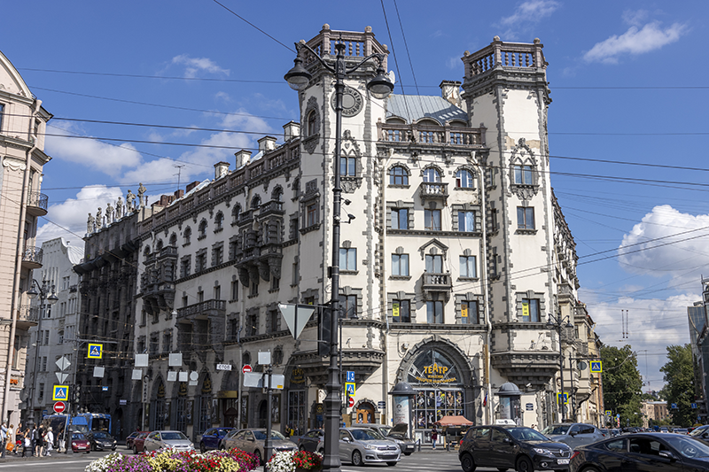
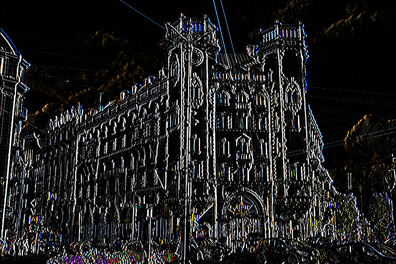
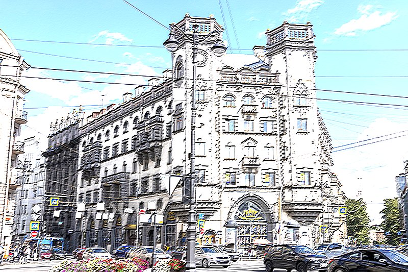
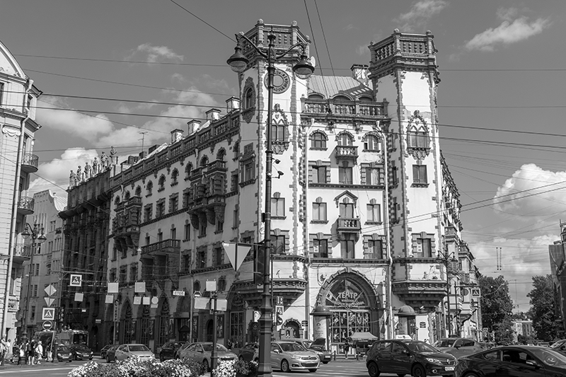
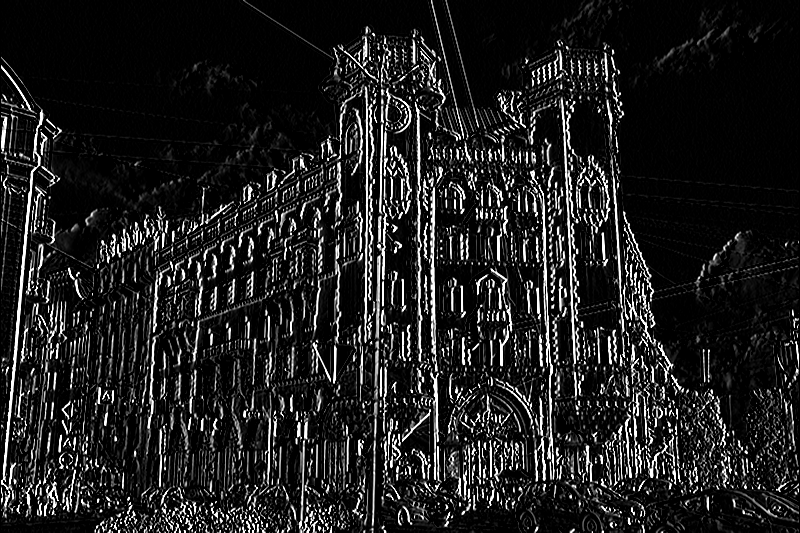
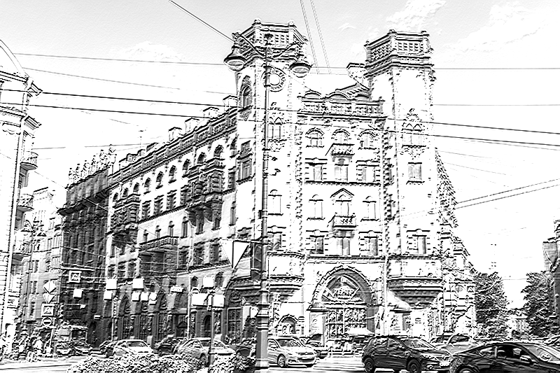

# Лабораторная работа 2

## 1. Выделение контуров на изображении

Свёртка, конволюция — операция в функциональном анализе, которая при применении к двум функциям `f` и `g` возвращает
третью функцию, соответствующую взаимнокорреляционной функции `f(x)` и `g(x)`:

```math
(f \ast g)(x) = \int^{+\infty}_{-\infty} f(y)g(x-y) \, dy = \int^{+\infty}_{-\infty} f(x - y)g(y) \, dy
```

В нашем случае (изображения) операция свертки `A` c ядром свертки `B` - процедура обработки изображения скользящим окном:

```math
\begin{flalign*}
    &A = \begin{bmatrix}
            0 & 1 & 2 & 3 & 4      \\[0.3em]
            5 & 6 & 7 & 8 & 9      \\[0.3em]
            10 & 11 & 12 & 13 & 14 \\[0.3em]
            15 & 16 & 17 & 18 & 19 \\[0.3em]
            20 & 21 & 22 & 23 & 24 \\[0.3em]
         \end{bmatrix}, 
    B = \begin{bmatrix}
            0 & 1 & 0 \\[0.3em]
            1 & 3 & 1 \\[0.3em]
            0 & 1 & 0 \\[0.3em]
         \end{bmatrix} \\\\
    &C = A \otimes B = B \otimes A = \frac{1}{\sum b_{ij}} 
         \begin{bmatrix}
            0 & 1 & 0 \\[0.3em]
            1 & 3 & 1 \\[0.3em]
            0 & 1 & 0 \\[0.3em]
         \end{bmatrix} \otimes
         \begin{bmatrix}
            0 & 1 & 2 & 3 & 4      \\[0.3em]
            5 & 6 & 7 & 8 & 9      \\[0.3em]
            10 & 11 & 12 & 13 & 14 \\[0.3em]
            15 & 16 & 17 & 18 & 19 \\[0.3em]
            20 & 21 & 22 & 23 & 24 \\[0.3em]
         \end{bmatrix} = \\\\
    &\frac{1}{7} 
         \begin{bmatrix}
            12 & 17 & 24 & 31 & 36      \\[0.3em]
            37 & 42 & 49 & 56 & 61      \\[0.3em]
            72 & 77 & 84 & 91 & 96      \\[0.3em]
            107 & 112 & 102 & 119 & 126   \\[0.3em]
            132 & 137 & 144 & 151 & 156 \\[0.3em]
         \end{bmatrix} = 
         \begin{bmatrix}
            1.71428571 & 2.42857143 & 3.42857143 & 4.42857143 & 5.14285714 \\[0.3em]
            5.28571429 &  6. &  7. &  8. &  8.71428571 \\[0.3em]
            10.28571429 & 11. & 12. & 13. & 13.71428571 \\[0.3em]
            15.28571429 & 16. & 17. & 18.  & 18.71428571 \\[0.3em]
            18.85714286 & 19.57142857 & 20.57142857 & 21.57142857 & 22.28571429 \\[0.3em]
         \end{bmatrix} \\\\
    &C_{22} = \frac{1}{7} \sum_{i, j} \left(
             \begin{bmatrix}
                6 & 7 & 8 \\[0.3em]
                11 & 12 & 13 \\[0.3em]
                16 & 17 & 18 \\[0.3em]
             \end{bmatrix} \otimes
             \begin{bmatrix}
                0 & 1 & 0 \\[0.3em]
                1 & 3 & 1 \\[0.3em]
                0 & 1 & 0 \\[0.3em]
             \end{bmatrix}\right) = \frac{1}{7} \sum_{i, j} \left(
             \begin{bmatrix}
                0 & 7 & 0    \\[0.3em]
                11 & 36 & 13 \\[0.3em]
                0 & 17 & 0   \\[0.3em]
             \end{bmatrix}
         \right) = \frac{1}{7} \cdot 84 = 12
\end{flalign*}
```

> Нормирование на величину, обратную сумме элементов ядра `B`, позволяет не выйти за границу диапазона яркостей
> изображения [0, 255] или [0, 1]. Перед обработкой необходимо привести тип данных к `float`, а значения яркостей 
> пикселей к диапазону [0, 1].

```python
import numpy as np
import cv2 as cv
a = np.array([range(25)], dtype=float).reshape((5, 5))
b = np.array([[0, 1, 0],
              [1, 3, 1],
              [0, 1, 0]], dtype=float)
c = cv.filter2D(src=a, ddepth=-1, kernel=b)
c /= np.sum(b)
```

Туториал: [Convolutions with OpenCV and Python](https://pyimagesearch.com/2016/07/25/convolutions-with-opencv-and-python/)

### Оператор Собеля

Оператор Собеля - дискретный дифференциальный оператор, вычисляющий приближённое значение градиента яркости изображения.

```math
\begin{flalign*}
    &G_y = \begin{bmatrix}
                1 & 2 & 1 \\[0.3em]
                0 & 0 & 0 \\[0.3em]
                -1 & -2 & -1 \\[0.3em]
           \end{bmatrix} \\\\
    &G_x = \begin{bmatrix}
                -1 & 0 & 1 \\[0.3em]
                -2 & 0 & 2 \\[0.3em]
                -1 & 0 & 1 \\[0.3em]
           \end{bmatrix}
\end{flalign*}
```

Пример обработки изображения:

<p align="center">
    
    <div align="center">Исходное</div>
<p align="center">
    
    <div align="center">Результат обработки G<sub>x</sub></div>
</p>
<p align="center">
    
    <div align="center">Результат обработки G<sub>y</sub></div>
</p>

Пример обработки полутонового изображения:

<p align="center">
    
    <div align="center">Исходное</div>
<p align="center">
    
    <div align="center">Результат обработки G<sub>x</sub></div>
</p>
<p align="center">
    
    <div align="center">Результат обработки G<sub>y</sub></div>
</p>

### Оператор Щарра

```math
\begin{flalign*}
    &G_y = \begin{bmatrix}
                3 & 10 & 3 \\[0.3em]
                0 & 0 & 0 \\[0.3em]
                -3 & -10 & -3 \\[0.3em]
           \end{bmatrix} \\\\
    &G_x = \begin{bmatrix}
                -3 & 0 & 3 \\[0.3em]
                -10 & 0 & 10 \\[0.3em]
                -3 & 0 & 3 \\[0.3em]
           \end{bmatrix}
\end{flalign*}
```

### Оператор Прюитта

```math
\begin{flalign*}
    &G_y = \begin{bmatrix}
                1 & 1 & 1 \\[0.3em]
                0 & 0 & 0 \\[0.3em]
                -1 & -1 & -1 \\[0.3em]
           \end{bmatrix} \\\\
    &G_x = \begin{bmatrix}
                -1 & 0 & 1 \\[0.3em]
                -1 & 0 & 1 \\[0.3em]
                -1 & 0 & 1 \\[0.3em]
           \end{bmatrix}
\end{flalign*}
```

### Детектор границ Канни

Ссылки:
- [Хабр](https://habr.com/ru/post/114589/)
- [OpenCV: Canny Edge Detection](https://docs.opencv.org/4.x/da/d22/tutorial_py_canny.html)

### Детектор углов Харриса

Ссылки:
- [OpenCV Harris corner detector](https://docs.opencv.org/3.4/d4/d7d/tutorial_harris_detector.html)
- [Хабр: Детекторы углов](https://habr.com/ru/post/244541/)

### Детектор окружности Хафа

Ссылки:
- [OpenCV: Hough Circle Transform](https://docs.opencv.org/4.7.0/d4/d70/tutorial_hough_circle.html)
- [Detecting Circles in Images using OpenCV and Hough Circles](https://pyimagesearch.com/2014/07/21/detecting-circles-images-using-opencv-hough-circles/)

## Задание

1. Реализовать вручную процедуру свертки с ядром произвольного размера `k х k`, `k` - нечетное:
  - оператор Собеля;
  - оператор Прюитта;
  - оператор Щарра
  - свой оператор (радиально симметричный для простоты)
  > Обычно изображение дополняется нулями (`padding`) на границах, размер `pad`'а - k/2 + 1.
  > Произвольный оператор необходимо нормировать - сумма всех элементов матрицы должна быть равна 1.
2. Сравнить свою реализацию с `filter2D` из `openCV`.
3. Реализовать процедуру детектирования контуров на изображении методом Канни из `OpenCV`.
4. Реализовать процедуру детектирования углов на изображении методом Харриса из `OpenCV`.
5. Реализовать процедуру детектирования окружностей на изображении преобразованием Хафа из `OpenCV`.