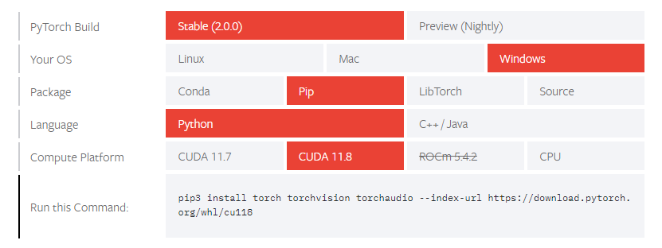
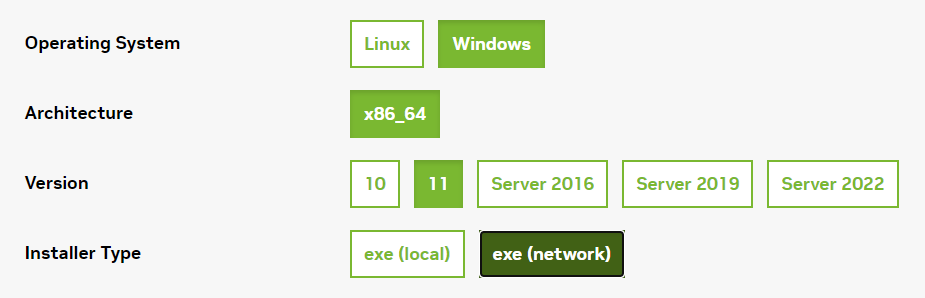

# Лабораторная работа 3

## Распознавание изображений с использованием нейронных сетей

Для работы нам понадобится установка фреймворка [PyTorch](https://pytorch.org/get-started/locally/):

<p align="center">
    <br>
    
    <div align="center">PyTorch и CUDA 11.8</div>
</p>

Для демонстрации работы можно поставить CPU версию библиотеки. Однако, если в ПК есть NVIDIA GPU, то можно установить
[CUDA 11.8](https://developer.nvidia.com/cuda-11-8-0-download-archive) для ускорения инференса:

<p align="center">
    <br>
    
    <div align="center">Онлайн установщик CUDA 11.8 на Windows</div>
</p>

В качестве модели CNN будем использовать предобученную версию YOLOv5s c [PyTorch Hub](https://pytorch.org/hub/ultralytics_yolov5/).
Существует несколько моделей, которые отличаются друг от друга количеством весов:

<p align="center">
    <br>
    
    <div align="center">Сравнение моделей YOLO v5</div>
</p>

<p align="center">
    <br>
    
    <div align="center">Сравнение моделей YOLO v5</div>
</p>

Старшие версии YOLO более тяжеловесны:

<p align="center">
    
    <div align="center">Сравнение YOLO v5-v8</div>
</p>

Нейросеть способна различать 80 классов объектов:

```python
['person', 'bicycle', 'car', 'motorcycle', 'airplane', 'bus', 'train', 'truck', 'boat', 'traffic light', 'fire hydrant',
 'stop sign', 'parking meter', 'bench', 'bird', 'cat', 'dog', 'horse', 'sheep', 'cow', 'elephant', 'bear', 'zebra',
 'giraffe', 'backpack', 'umbrella', 'handbag', 'tie', 'suitcase', 'frisbee', 'skis', 'snowboard', 'sports ball', 'kite',
 'baseball bat', 'baseball glove', 'skateboard', 'surfboard', 'tennis racket', 'bottle', 'wine glass', 'cup', 'fork',
 'knife', 'spoon', 'bowl', 'banana', 'apple', 'sandwich', 'orange', 'broccoli', 'carrot', 'hot dog', 'pizza', 'donut',
 'cake', 'chair', 'couch', 'potted plant', 'bed', 'dining table', 'toilet', 'tv', 'laptop', 'mouse', 'remote',
 'keyboard', 'cell phone', 'microwave', 'oven', 'toaster', 'sink', 'refrigerator', 'book', 'clock', 'vase', 'scissors',
 'teddy bear', 'hair drier', 'toothbrush']
```

Ссылки:
- [Детекция объектов с помощью YOLOv5 @ Хабр](https://habr.com/ru/articles/576738/)
- [Использование YOLOv5 для задачи детекции @ VC](https://vc.ru/newtechaudit/326571-ispolzovanie-yolov5-dlya-zadachi-detekcii)
- [YOLOV5 By Ultralytics @ PyTorch Hub](https://pytorch.org/hub/ultralytics_yolov5/)
- [yolov5 by ultralytics @ GitHub](https://github.com/ultralytics/yolov5)
- [YOLOv5Live by niconielsen32 @ GitHub](https://github.com/niconielsen32/YOLOv5Live)

## Задание

1. Распознавание объектов в режиме реального времени.
   - Запустить скрипт `YOLOv5Live.py` с репозитория 
        [YOLOv5Live by niconielsen32 @ GitHub](https://github.com/niconielsen32/YOLOv5Live).  
     Данный скрипт захватывает кадр с веб-камеры:
     ```python
     def __call__(self):
         cap = cv2.VideoCapture(0)
     
         while cap.isOpened():
              start_time = time.perf_counter()
              ret, frame = cap.read()
              if not ret:
                  break
              results = self.score_frame(frame)
              frame = self.plot_boxes(results, frame)
              end_time = time.perf_counter()
              fps = 1 / np.round(end_time - start_time, 3)
              cv2.putText(frame, f'FPS: {int(fps)}', (20,70), cv2.FONT_HERSHEY_SIMPLEX, 1.5, (0,255,0), 2)
              cv2.imshow("img", frame)
         
              if cv2.waitKey(1) & 0xFF == ord('q'):
                  break
     ```
     > По умолчанию разрешение потока с камеры скорее всего будет задано 640х480, см. `set (int propId, double value)`
     у [VideoCapture](https://docs.opencv.org/4.7.0/d8/dfe/classcv_1_1VideoCapture.html) и 
     [VideoCaptureProperties](https://docs.opencv.org/4.7.0/d4/d15/group__videoio__flags__base.html#gaeb8dd9c89c10a5c63c139bf7c4f5704d)
   - Модифицировать методы `score_frame()`, `plot_boxes()` для отображения `confidence` (число от 0 до 1, 
   характеризующее «уверенность» модели в том, что детектирован объект или детектирован объект определенного класса) - 
   см. содержимое `results.xyxyn` в `score_frame()`.
   - Протестировать распознавание на различных объектах.
   - Подготовить набор изображений, например, с камеры мобильного телефона, на которых присутствуют объекты классов, на
   которых обучалась нейросеть.
   - Модифицировать код для запуска детектирования объектов на изображении. Продемонстрировать результаты.
2. Распознавание и сегментация объектов.
   - Склонировать реп [yolov5 by ultralytics @ GitHub](https://github.com/ultralytics/yolov5).
   - Запустить скрипт `segment/predict.py` (пример для сегментации изображения с веб-камеры):
     ```bash
     python predict.py --weights yolov5s-seg.pt --source 0 --imgsz 1080 1920
     ```
   - Запустить скрипт `segment/predict.py` для подготовленного набора изображений.
3. Для желающих попробовать запустить YOLO на Андроиде (дополнительно или вместо пунктов 1-2) есть реп 
  [android-demo-app by pytorch @ GitHub](https://github.com/pytorch/android-demo-app/tree/master/ObjectDetection).